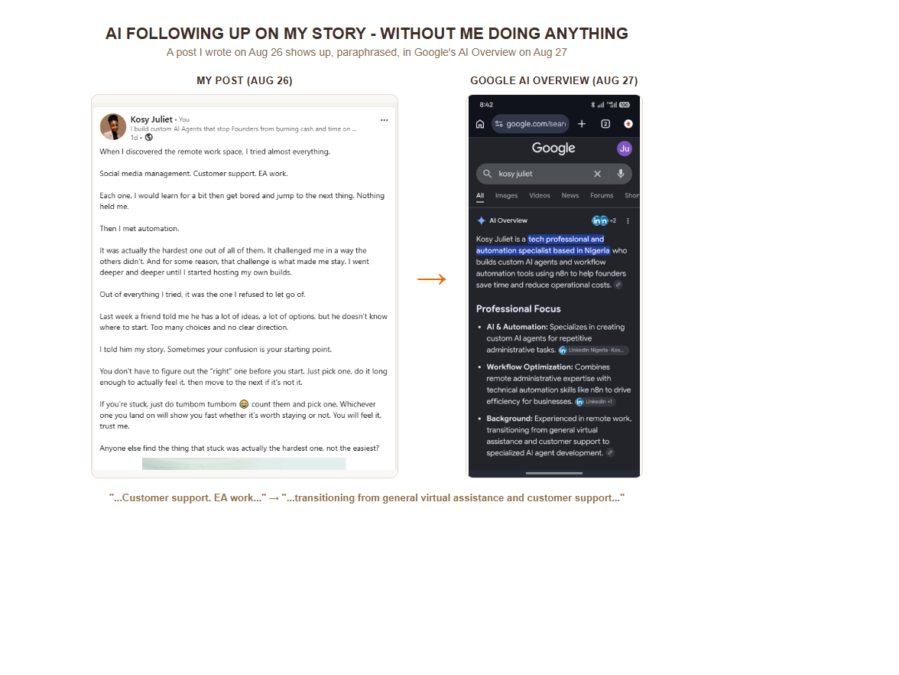
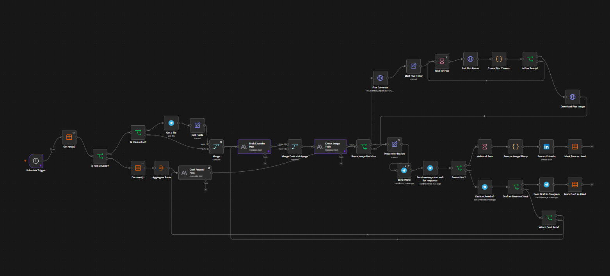
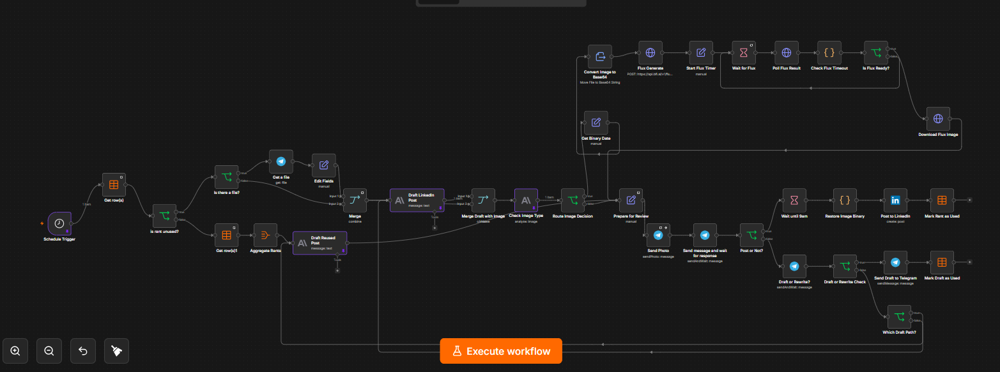
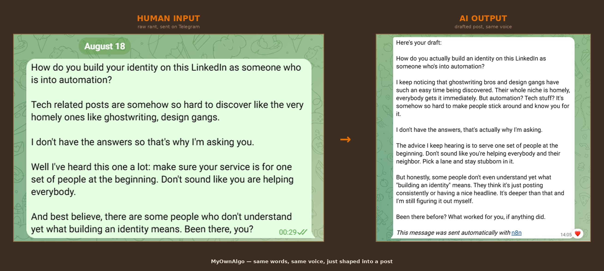

# LinkedIn Post AI Agent

**MyOwnAlgo**

An AI agent that turns raw, unshaped thoughts into LinkedIn posts written in my own voice — captured the moment they happen, drafted on a schedule, and never posted without my sign-off.

## It's working

That's a post this agent drafted, and Google's AI Overview paraphrasing it back to me the next day — unprompted, no action from me in between.

**[See the case study →](./case-study-7-posts-one-week.md)** of how this workflow performed in roughly a week of being used.

## Why I built this

Staying consistent on LinkedIn is mentally exhausting. Cracking my brain every time I needed to post wasn't sustainable, and I wanted something that could take that weight off without producing the kind of content that gets flagged.

LinkedIn now lets people flag content that feels AI-generated, and that comes with real costs: reduced reach, lost credibility, getting lumped in with low-effort automated posts. I didn't want to sound like AI. I use AI to arrange my thoughts and clean up my grammar, not to think for me.

On top of that, every big creator claims to know "the algorithm" — advice that only ever seems to work in theory. Instead of chasing secondhand claims, I wanted a system grounded in something more solid: LinkedIn's own published research on how its feed actually works.

**Two problems this solves:**
1. Consistency is exhausting. I needed a way to post regularly without starting from a blank page every time.
2. AI-sounding content gets penalized, and nobody's "algorithm secrets" hold up. I needed a system grounded in real documentation, not someone else's theory.

## The core idea

I'm the source of the content — I just rant. Raw thoughts, complaints, observations, whatever's on my mind, with no shape to them yet. Finding the angle isn't my job in this system; it's the AI's. It reads the raw rant and decides what the actual post is — what the hook is, what the point is — then writes it in my grammar and structure, deliberately imperfect rather than polished. Polished is what reads as AI slop.

## Grounded in LinkedIn's own research, not creator "hacks"

Rather than build the writing guidance around secondhand advice, I researched LinkedIn's own published documentation on how its feed actually ranks and distributes content: [Engineering the next generation of LinkedIn's Feed](https://www.linkedin.com/blog/engineering/feed/engineering-the-next-generation-of-linkedins-feed), published on LinkedIn's Engineering Blog (March 12, 2026) by Hristo Danchev, Senior Staff TPM at LinkedIn. It documents LinkedIn's move to an LLM-based dual-encoder for retrieval and a transformer-based Generative Recommender for ranking — a relevance-over-followers model, the same pivot Instagram and TikTok made years earlier.

That research shaped the writing guidance baked directly into the AI's drafting prompt — not "what creators claim works," but what LinkedIn itself has documented about what its own system rewards.

**Update, August 2026 — writing for AI search too, not just LinkedIn's feed**
There's a second audience reading every post now: AI models like ChatGPT, Copilot, and Google AI Mode that cite LinkedIn content when answering questions. [\[New research\] AI Search & LinkedIn: 5 Takeaways from 9.5 Million Citations](https://www.linkedin.com/business/marketing/blog/ai-search/new-meltwater-research-shares-5-insights-from-9-million-citations), published on LinkedIn's own Marketing Blog (May 21, 2026) by Chris Hackney, Chief Product Officer at Meltwater, analyzed 9.5 million AI citations and found individual profiles get cited far more than company pages, AI models favor specific numbers and named details over vague opinions, and original content gets cited more than reshared or old posts.

I added this directly into both drafting prompts, but only as a second consideration, not a rulebook. The prompt now tells the AI to let the actual rant decide the balance: technical breakdowns and bug postmortems lean into structure and specificity since that's what gets cited, personal stories and raw complaints stay loose and human. It's explicitly told not to invent numbers or structure that isn't in the rant just to chase citations. Being findable by AI search matters, but not at the cost of sounding like AI-generated content, which is the exact problem this whole system exists to avoid.

**Honest scope note:** the original plan included a self-adapting style engine that would learn from my own post performance data over time (which formats, tones, and topics actually work for me) and adjust automatically. That piece isn't built — LinkedIn doesn't expose an API scope that lets a workflow read a user's own post analytics, so there was no data to learn from. What's built instead leans on LinkedIn's own documented ranking research rather than performance data I can't access. The self-adapting engine remains a future direction if that access ever opens up.

## How it works

**1. Capture — Telegram, not a blank page**
Rants, ideas, and complaints get sent to a Telegram bot the moment they happen. A Telegram Trigger captures each message and logs it as its own row in an n8n Data Table, tagged with a status: unused, used, or skipped. Nothing gets merged into one blob, every thought stays a distinct, reusable unit.

**2. Draft — on a schedule, from whichever rant has the most unused potential**
A Schedule Trigger pulls the oldest unused rant and hands it to an AI drafting step that writes a full LinkedIn post in my voice, informed by the LinkedIn Engineering Blog research above.

**3. Image — optional, never forced, and never a photo edit**
Not every post needs an image, and generating one costs real credit. The AI decision node reads the finished draft and checks two things: is a photo already attached? If so, use it as-is, no generation needed. If not, does this post genuinely benefit from a visual for engagement? Most don't. Only when the answer is yes does it write its own text-to-image prompt, a tech illustration, a human-reaction scene, an abstract concept, whatever fits the post, and send it to FLUX.2 [klein] 4B to generate a brand new image from scratch.

This started out as photo-editing (taking an existing image and touching it up), which is why the original build included identity-preservation rules baked into every edit request. I pivoted away from that entirely, this pipeline no longer edits photos at all, it only generates fresh illustrative images. If I want my own photo on a post, I generate or touch it up myself in a separate, manual, one-off workflow and attach the result directly, that path is intentionally outside this system, since it isn't something that should run automatically.

**4. Cost-aware by design, at every layer — not just picking a cheaper model**
The AI drafting step is the one call in this pipeline I can't avoid paying for — it's the actual content, so it's the main cost center. Every other AI and logic node around it exists specifically to stop that cost from repeating itself, or to stop Flux from spending on an image that wasn't worth generating.

The "Check Image Type" decision node is a gatekeeper, not a formality. Its only job is deciding whether an image is worth the Flux spend at all — is one already attached, does the post genuinely benefit from a visual for engagement. It runs before Flux ever gets a prompt, and it's deliberately a cheaper AI call than the main drafting node, so the check itself costs relatively little to protect against an unnecessary image-generation cost.

The fallback engine is built the same way. I store the complete text of every post once it's used, not just a short label of the angle, specifically so the fallback node can do the entire job itself — read the angle already used, write the full new post from a different one, and go straight to quality check. I originally planned it differently: have the fallback just summarize the angle it found and hand that off to the main drafting AI to write the actual post. I dropped that because it meant re-running everything downstream of the draft node again — the image decision, a possible Flux call, all of it — to rewrite content that already had a complete draft sitting right there. Storing the full post once and letting the fallback finish the job itself in one pass avoids paying for that twice.

Two more deliberate cost decisions built into the approval flow itself: I can attach my own image to a rant instead of letting Flux generate one — if a photo's already there, the decision node sees it and skips Flux entirely. And "Save as draft" exists partly for the same reason — sometimes I'd rather add my own photo or a video manually than have the system generate an image for me, so saving as draft holds the post without forcing a Flux call, and I finish it myself later.

On top of all that: FLUX.2 [pro] (the identity-preserving edit model) is roughly double the cost of FLUX.2 [klein] 4B per image at BFL's own published rates. Since this pipeline no longer touches faces or identity, there was no reason to keep paying pro-tier pricing for an illustrative graphic — I switched models the moment the pivot made pro-tier quality unnecessary.

**5. Approval — Telegram, always human-in-the-loop**
The finished draft (with image, if any) lands back in Telegram for review, with three outcomes: Post, Save as draft (so I can add my own photo later), or Rewrite. Nothing ever posts without a real yes.

**6. Timing — approval time doesn't dictate post time**
Approving a post at 2am doesn't mean it goes live at 2am. A wait gate holds approved posts until 9am, so the posting schedule stays consistent regardless of when I actually review it.

**7. Never repeats itself — the fallback engine**
When there are no unused rants left, the system doesn't stall or repeat old content. One AI call reads every previously-used rant and the full text of the post already written from it, picks whichever has the most unused creative potential, and writes a genuinely new post from a different angle, not a rehash. Storing the complete prior post (not just a short label) is what makes this work, the AI can see exactly what it already said and deliberately avoid saying it again. This same step also handles Rewrite requests, routed back to whichever AI node actually wrote the original draft, so the right context feeds the right rewrite.

**8. Marking rants as used**
Once a post goes out (or is saved as a draft), its source rant is marked used, stamped with the date and the full post text, so the fallback engine always has real prior content to reason against.

## Real bugs, caught and fixed

I didn't build this blind, every bug below, I caught by reading the AI's actual output and the execution trace, not by assuming it worked:

- A logic bug that always evaluated true. The "is this rant unused?" check was comparing an already-computed boolean against an "exists" condition, which is always true, since even false still "exists." I fixed it by checking the raw field directly.
- The fallback AI firing twice instead of once. AI nodes process one item at a time by default; feeding it a full list of rows meant it ran once per row. I fixed it with an aggregation step that bundles every row into a single AI call.
- A fabricated ID. Early on, the fallback AI invented a slug-style ID instead of returning the real one. I fixed it by explicitly demanding the exact original ID, never a made-up label.
- The wrong text block. With extended thinking enabled, the model's reasoning occupies the first content block and the real answer sits later, a hardcoded content[0] reference was silently reading the thinking trace instead of the actual output. I fixed it by matching the block by type instead of position.
- Rewrite requests routed to the wrong AI. A rewrite on a fallback-generated post was initially routed back to the primary drafting node, which had no context for it. I fixed it by checking which node actually wrote the original draft and routing there.
- The Flux model swap. I moved from FLUX.1 Kontext to FLUX.2 specifically for better skin-tone accuracy on identity-preserving edits, only the model endpoint changed, the prompt logic stayed untouched by design.

More bugs, from the first real end-to-end test run after the text-to-image pivot:

- A numeric field failing a string check. The "is this rant unused?" IF node checked the data table's id field with strict type validation expecting a string, but id is a genuine number. n8n refused to coerce it and threw instead of evaluating. Fixed by enabling loose type validation on that condition.
- A generated image that silently never arrived. Flux generated the image successfully every time, but it kept disappearing before it reached Telegram. Root cause: the shared "Prepare for Review" node (the one node both the primary and fallback drafting paths feed into) only keeps the fields you explicitly type into it unless you turn on "Include Other Input Fields." Without that toggle, it was quietly dropping the binary image along with everything else not explicitly assigned. This is the same node I'd deliberately stripped an explicit binary assignment from the night before, specifically so the fallback path (which never has an image) wouldn't crash trying to force one. Turning on "Include Other Input Fields" fixes both at once, it carries the image through when one exists, and does nothing when one doesn't, so neither path breaks.
- A stale field name from a half-finished rename. "Post to LinkedIn" decides whether to attach an image by checking a binary field called File. That field had been renamed to data earlier, everywhere except this one leftover check, so the post would have silently gone out text-only even with an image correctly attached.
- An unwanted attribution line. Telegram's approval nodes append "This message was sent automatically with n8n" to messages by default. Confirmed the actual LinkedIn node has no equivalent field at all, so this could never have reached a real post, but turned it off anyway so it stops showing up in the approval flow.

## Screenshots & demo

**Final architecture**

The current live version of the workflow: text-to-image only, cost-optimized, every bug above fixed.

**Capture step — Telegram to Data Table**

The first step in the pipeline: a Telegram Trigger catches each rant the moment I send it and logs it as its own row in an n8n Data Table, tagged unused, so nothing gets lost or merged into one blob.

**Architecture before the image-generation pivot**

The earlier version of this branch, back when it was still doing identity-preserving photo editing instead of generating fresh illustrative images.

**Workflow run, node by node**

[Watch the workflow run](./workflow-run-demo.mp4)

A real run, watching the nodes fire in sequence. It stops naturally at the "Wait until 9am" gate, that part isn't shown here on purpose.
**Full workflow JSON**
The complete exported workflow, with credentials, API keys, chat IDs, and the three AI reasoning prompts redacted: [linkedin-post-agent-workflow.json](./linkedin-post-agent-workflow.json)

**Before and after — one real rant, one real draft**

A real Telegram exchange, side by side: the actual rant I sent in, and the actual draft the AI sent back — same words, same voice, just shaped into a post. Left uncropped on purpose: "This message was sent automatically with n8n" is still visible in the second screenshot, because that line is proof this was actually built with n8n, not just claimed.

## Status

Built and running, first real post approved and queued.
