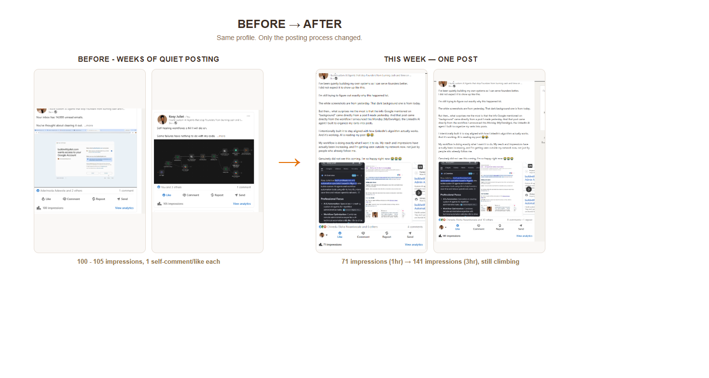
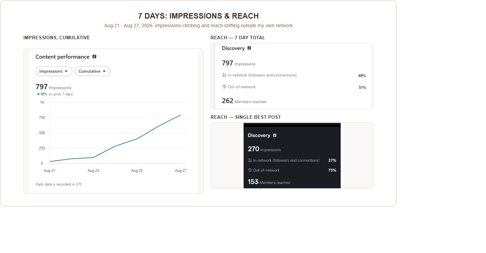
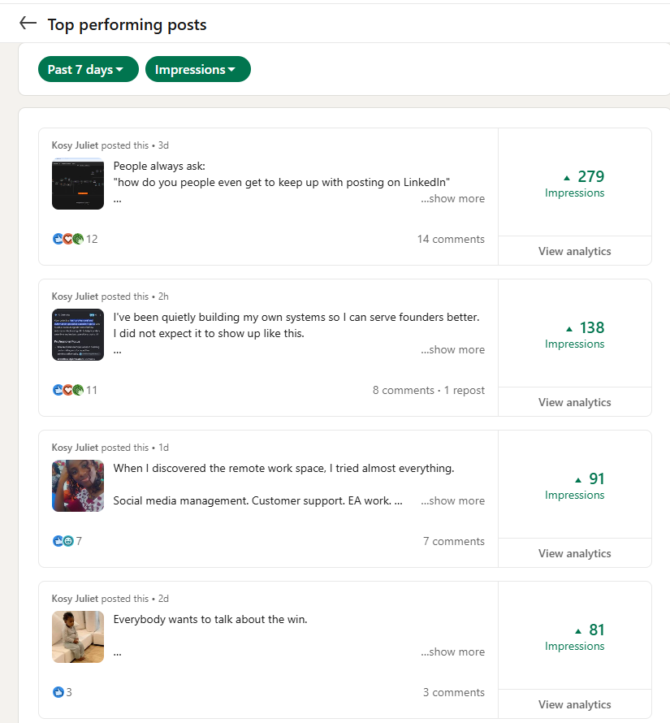
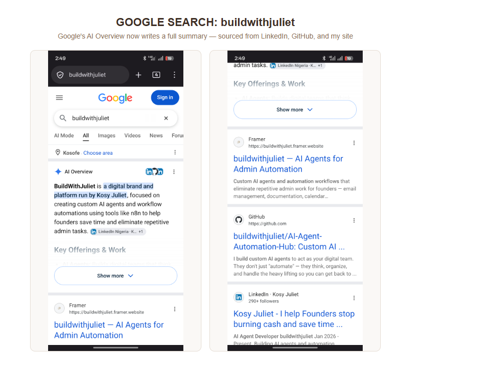

# 7 Posts, One Week (and a Few Days): The Week Google Started Explaining Who I Am

I run **[MyOwnAlgo](.)**, the LinkedIn agent in this folder, to turn raw text and picture notes into posts structured around LinkedIn's own published research on how its feed actually ranks content — not just "post something every day."

This is what happened in the roughly one week, seven posts, since I started posting with it. I wasn't tracking it for a case study. I was just checking my own numbers, then noticed something I didn't expect at all: Google's AI Overview started summarizing who I am, and one line in it traced directly back to a post from the day before.

Here's the whole trail.

## Before -> After

Two posts from a few weeks earlier, before I was posting with the agent, sat at 100 and 105 impressions — one like, one comment, both mine. This week, one post alone climbed from 71 impressions in its first hour to 141 by hour three, and kept climbing.

## 7 days, climbing

Across the week, cumulative impressions went from a slow start to **797 total, up 18% vs. the previous 7 days**. Reach also shifted in *composition* — 51% of the people reached over the week were out-of-network (people who don't already follow me), for 262 members reached total. One single post on its own hit 73% out-of-network reach.

## People actually responded

Top posts by impressions this week:

- "People always ask: how do you people even get to keep up with posting on LinkedIn" — 279 impressions, 14 comments
- "I've been quietly building my own systems..." — 138 impressions, 8 comments, 1 repost
- "When I discovered the remote work space..." — 91 impressions, 7 comments
- "Everybody wants to talk about the win" — 81 impressions, 3 comments

Worth being upfront: some of those comment counts include my own replies — I reply to everyone. That's not padding, that's what real conversation on a thread looks like. It's still a real shift from posts that got one comment, from me, and nothing else.

## Google noticed

I searched my own brand name, "buildwithjuliet," on Google. The AI Overview now writes a full summary of what I do, pulling from LinkedIn, GitHub, and my site together, on both mobile screens I checked.

## AI following up on my story, without me doing anything

One of this week's posts talked about my background: *"Social media management. Customer support. EA work... Then I met automation."* Posted Aug 26.

The next day, I searched my own name, "Kosy Juliet." The AI Overview's "Background" line reads: *"transitioning from general virtual assistance and customer support to specialized AI agent development."* A direct paraphrase of my own post, cited a day after I wrote it, with no action from me in between.

## What I think this is actually evidence of

This is one profile, about a week of data — not a controlled test, and I'm not claiming a formula that works for everyone. But it's a fairly clean before/after: same person, same brand, the only material change being how the posts were structured going in.

One thing I checked before writing this up: was this just because I'd submitted my site to Google Search Console? I don't think so. Search Console affects whether my own site's pages get crawled, not whether Google's AI Overview decides to synthesize a bio about me as a person. The Overview is quoting LinkedIn post content specifically, word-traceable to a post from the day before — that points at the structured posting itself, not at site indexing.

## Try it

The workflow that generated these posts is in this same folder — see the [README](README.md) for the architecture and the n8n workflow export.
