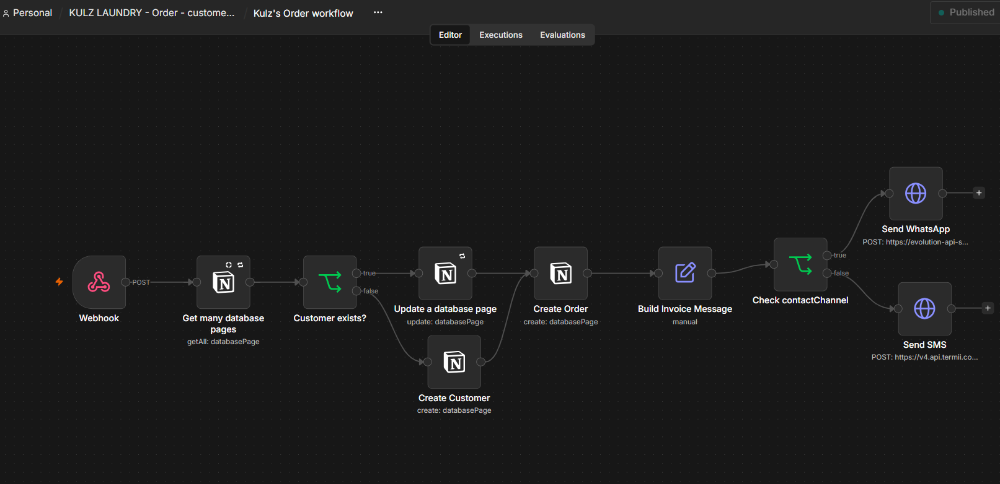
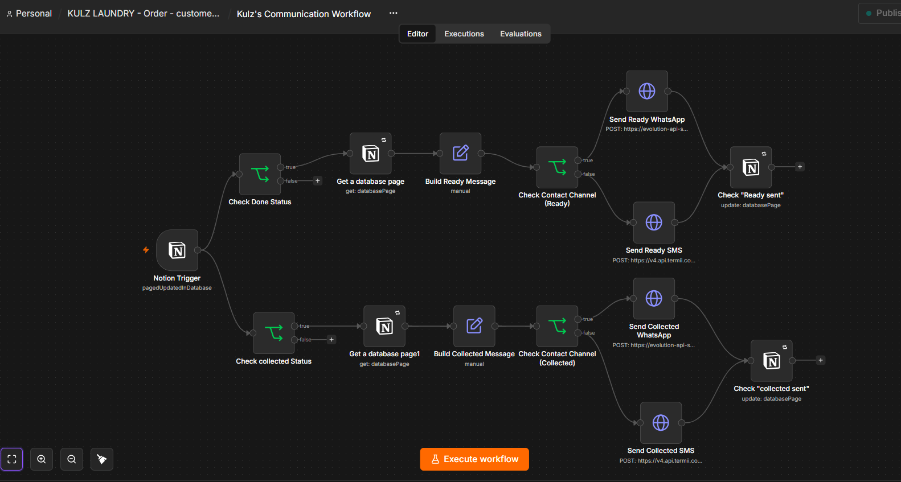
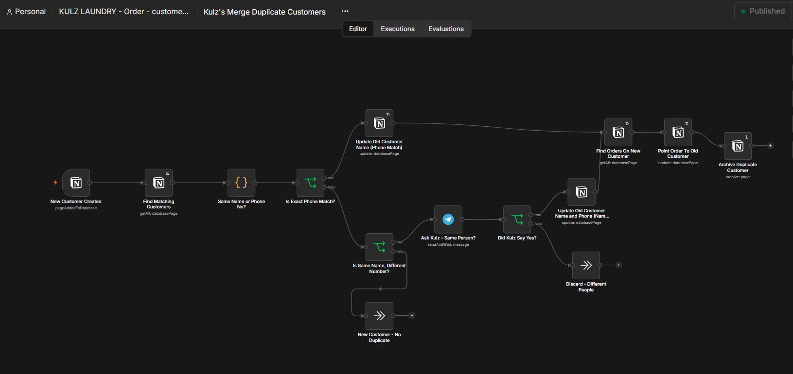

# Order & Customer Communication — Kulz Laundry

An end to end order intake, invoicing, and status communication system built for a real laundry business in Awka, Anambra State, replacing a fully manual paper and WhatsApp process.

**Built with:** Tally (order intake form), n8n (automation), Notion (CRM database), Evolution API (WhatsApp), Termii (SMS)

## The Problem

Every order, payment, and running balance was tracked by hand on paper. Handwritten records get lost, get damaged, or simply become unreadable over time, and there was no way to search or total them. Every customer update, order confirmation, "your laundry is ready," "your laundry was collected," was typed out manually on WhatsApp, one conversation at a time, and depended entirely on someone remembering to send it.

The most costly version of this problem was disputes. Some customers would collect their laundry and later claim they hadn't. Collection was purely a verbal handoff, nothing was ever recorded at that moment, so there was no way to prove either side of the disagreement.

## The Solution

A Tally intake form that staff fill out per order, feeding straight into a Notion CRM (Customers, Orders, Payments) where every balance is computed automatically and never entered by hand. From there, two n8n workflows take over: one handles the order itself, and a second reacts to status changes and sends the right message automatically at each stage. A timestamped "collected" message is sent the moment an order is marked collected, which doubles as proof of handover, not just a notification, directly solving the dispute problem.

## How It Works

* **Order intake** — Tally form submission triggers an n8n webhook, which checks Notion for an existing customer by phone number, creates the customer if they're new (or updates their contact details if found), creates the order, and sends the first invoice message automatically.
* **Status communication** — a separate workflow watches for status changes in Notion. When an order is marked Done, a "ready for pickup" message goes out. When it's marked Collected, a timestamped confirmation goes out, including any remaining balance if the customer hasn't fully paid.
* **Channel routing** — every message checks the customer's stated contact preference and sends over WhatsApp (a self hosted Evolution API instance) or SMS (Termii) accordingly.
* **Duplicate prevention** — a third workflow runs whenever a new customer record is created, checking for existing customers with a matching phone number or name before letting the record stand. See below for why this needed a human in the loop, not just logic.

## Architecture

**Order intake**

**Status communication**

**Duplicate customer merge**

## Design Decisions

These aren't bugs that got fixed. They're places where the system was deliberately built around how people actually behave, not how a clean database would prefer they behave.

1. **Why an ambiguous duplicate gets a human, not a guess.** Real customers don't follow tidy rules. Someone might drop off a loved one's laundry under their own name, with no idea there's already an account for that household under a different name or number. An exact phone number match is safe to merge automatically, no ambiguity there. But same name, different phone number, is genuinely unclear. It could be the same person texting from a new line, or two different people who happen to share a name. Guessing wrong either way causes real damage, merging two strangers' balances together, or leaving a genuine duplicate split in two. So that one specific case doesn't get guessed at all. The workflow messages the business owner directly on Telegram with a plain yes or no question, and only merges once he confirms. Every unambiguous case still resolves itself automatically.

2. **Why contact details get refreshed on every single order, not just the first time.** A customer's preferred contact channel isn't fixed. Someone might want WhatsApp today and SMS tomorrow, for reasons that are entirely their own. So the order workflow always updates the customer's phone number and contact preference before creating the order, rather than trusting whatever was entered the very first time they were added.

3. **Why the balance never depends on anyone's memory.** Lifetime spend, total paid, and what's still owed are never typed in by hand, and they never get forgotten. The moment an order or a payment is recorded, those numbers recompute themselves straight from the actual records. There's nothing for a person to remember to update, and nothing for a person to get wrong.

## What Broke

**Notion's built in ID counter doesn't reset on delete.** The Order # field is Notion's native auto incrementing ID property. Deleting every row in the database does not reset it, the counter is attached to the property itself, not the data, so it keeps counting from wherever it left off. The only real fix is deleting and recreating the property itself, which resets the counter to zero while leaving the database, its relations, and every workflow connection untouched.

## Workflow files

- [order-workflow.json](./order-workflow.json)
- [communication-workflow.json](./communication-workflow.json)
- [merge-duplicate-customers-workflow.json](./merge-duplicate-customers-workflow.json)

Credentials and API keys are redacted in all three exports.
