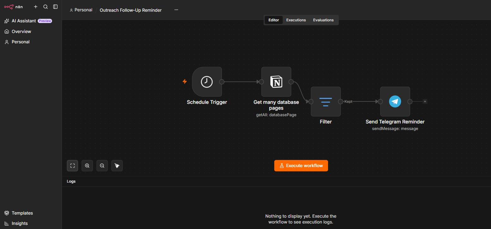

# Outreach Follow-Up Reminder

An always-on agent that catches stale leads before they get forgotten.

## The Problem

Cold outreach and lead tracking tend to fail the same way. Someone logs a prospect with a "follow up by" date, moves on to the next one, and life happens. New prospects keep getting added, but nobody circles back to check what's overdue. Weeks later the tracker is full of stale rows, and there's no way to tell at a glance who actually needs a nudge today versus who's simply been forgotten.

This isn't a "no tracker" problem. Most people have one. It's a "the tracker depends on remembering to check it" problem, and remembering is exactly the thing that fails first.

## The Solution

A daily n8n agent that reads a Notion-based lead pipeline every morning, filters it down to only the rows that are actually due, and pushes a plain-language reminder straight to Telegram. No dashboard to remember to open. No scrolling a database looking for dates. Just a message that shows up when it matters.

## How It Works

* **Scheduled check** — runs once a day at 8am.
* **Pulls the whole pipeline** — reads every row from the lead-tracking database.
* **Filters to what's actually due** — keeps only rows where the follow-up date is today or earlier. Everything else is silently skipped: no clutter, no false urgency.
* **Sends a real reminder** — each overdue row becomes a plain-text Telegram message with who it is, what company, what the next action is, and what stage they're at. Ready to act on immediately, not something to interpret.

## Architecture

Schedule Trigger → Get lead pipeline (Notion) → Filter (due today or earlier) → Send reminder (Telegram)

## Why This Matters

Most CRMs and trackers don't fail because they're the wrong tool. They fail because checking them is a task someone has to remember to do, on top of everything else they're doing. Turning "remember to look" into "get told" is a small change with a disproportionate effect on whether follow-ups actually happen, which is usually the difference between a lead that converts and one that quietly goes cold.

[Workflow JSON (credentials redacted)](./outreach-follow-up-reminder.json)
