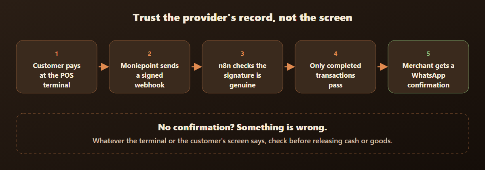
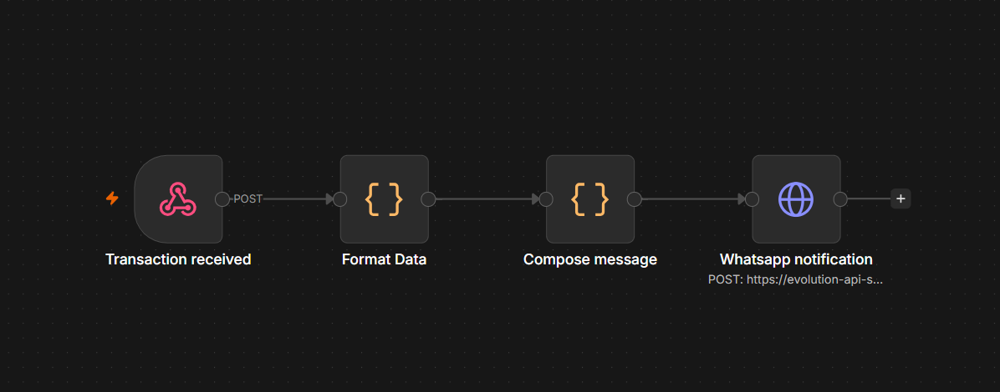

# POS Payment Confirmation

Real-time payment confirmation for a POS merchant, straight from her payment provider, so she never has to trust a screen.

**Status:** built and tested on live transfers and card purchases with one merchant's terminal. It has the potential to grow into a product as more merchants use it, and that is the direction I'm exploring.



## Why I built it

A woman who had just started a POS business told me she had been duped twice in her first month.

In one case she handed the customer the terminal so he could enter his PIN for the withdrawal. The next thing she saw was something the screen had never shown her before: a "Done" message, smaller than the usual button, instead of "Successful". She checked the transaction history on her terminal and found no record of that transaction. She was careful, and nothing was lost that time. Fake payment screenshots are another common trick, where the goods leave before the money ever arrives.

What these cases share is that the merchant is asked to trust a screen, either the terminal's or the customer's phone, at the busiest and most pressured moment of the day. I can't say how that "Done" message appeared, and I am not claiming the terminal was compromised. What mattered was that the real record of what happened was missing from the screen she was reading.

Moniepoint already sends merchants notifications for successful transactions, and that is exactly the source I chose to rely on. What was missing was one clear, verified confirmation that doesn't depend on reading any screen.

## The idea

Don't trust any screen. Trust the payment provider's own record.

Moniepoint lets a merchant subscribe a web address to events from their POS terminal. Each event is signed by Moniepoint. My workflow checks that signature, checks that the transaction really completed, and only then sends the merchant a WhatsApp message with the amount and a short reference.

**The rule for the merchant:** if the confirmation doesn't arrive, something is wrong, whatever the terminal or the customer's screen says. Investigate before releasing cash or goods. This should sharply reduce the chance of being duped, even on a busy day.

## How it works

1. A transaction happens on the merchant's POS terminal.
2. Moniepoint sends a signed webhook to the workflow.
3. **Format Data** checks the signature. A message that doesn't pass stops with an error, so a forged message can never produce an alert.
4. **Compose message** only lets confirmed transactions through: transfers need `COMPLETED` and `APPROVED`, card purchases and withdrawals need `SUCCESSFUL` and code `00`. Failed or declined transactions send nothing.
5. **Whatsapp notification** sends the merchant the amount in naira, the payer's name for transfers, the time and a short reference.

The alert looks like this:

```
✅ Payment confirmed

₦100 from Jane Doe has landed in your account.
Time: 6:39 PM
Ref: 801984

~YourBrand
```



## Built with

- **n8n** for the workflow, with JavaScript Code nodes for the signature check and the message.
- **Moniepoint POS webhooks** as the source of truth.
- **Evolution API** to deliver the WhatsApp message.

## What I learned while building it

- **A terminal is required.** A business account with no POS terminal fires nothing, and neither does a plain transfer to the account's phone-number account number.
- **A terminal has its own account number.** Transfers to that number are what produce the event.
- **Approval changes the timing.** With auto approval off, the event only fires when the merchant accepts the transfer on the terminal. One arrived 34 minutes after the customer sent it.
- **Money arrives in kobo,** so 10000 means ₦100.
- **The payer's name is inside a text field** in the event, which has to be opened before it can be shown.
- **Every merchant's subscription has its own secret,** so the signature check needs one secret per merchant.

A redacted example of the event is in [`sample-event.json`](./sample-event.json).

## Limits, and what comes next

- It confirms a payment at the moment it completes. It does not detect a reversal or dispute afterwards.
- A confirmation can arrive late, for example while a transfer waits for the merchant's approval.
- Today it is one workflow per merchant. With many merchants I would move to one shared workflow with a small list of clients.

## In this folder

- [`pos-payment-confirmation.json`](./pos-payment-confirmation.json): the n8n workflow, importable, with every secret replaced by a placeholder.
- [`sample-event.json`](./sample-event.json): an example of the event Moniepoint sends, with made-up values.
- `flow-diagram.png` and `workflow-canvas.png`: the diagram above and the workflow as it looks in n8n.

Secrets, API keys, phone numbers, real names and terminal identifiers are removed or replaced with placeholders.
