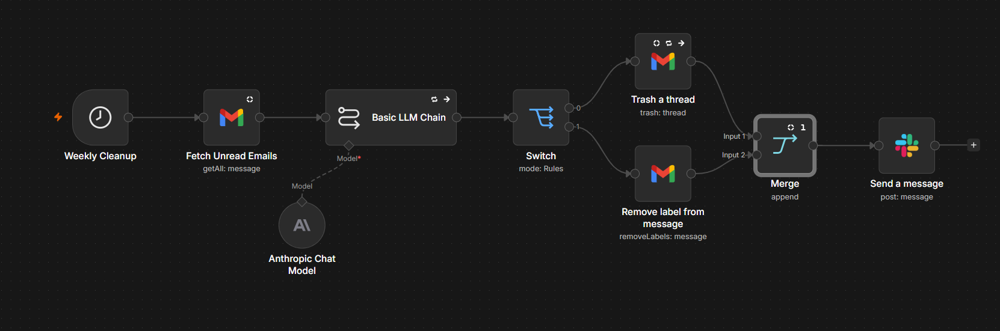
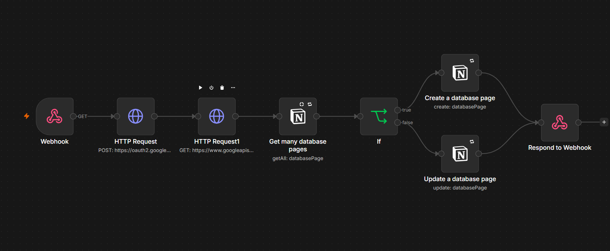

# Weekly Inbox Cleaner

A one-time, powerful inbox reset tool designed to clear massive email backlogs instantly.

## The Problem
I had nearly 300 emails cluttering my inbox, acting as a mental roadblock to testing and launching new projects. I didn't need "triage"—I needed a way to wipe the slate clean in one go.

## The Solution
I built this n8n workflow as a high-speed cleanup engine. It doesn't continuously organize your mail; it performs a deep, one-time pass to trash or archive the backlog, resetting your inbox to zero so you can start fresh.

## How It Works
* **Manual/Triggered Execution**: This is a "clean-and-reset" workflow that runs on-demand.
* **Batch Processing**: It fetches your unread emails and processes them in bulk.
* **Destructive Logic**: Designed specifically to trash irrelevant threads and archive the rest, clearing the clutter in a single execution.
* **Stop-State**: Once the cleanup is complete, the workflow remains idle until you decide you need another total reset.

## Benefits
* **Instant Inbox Zero**: Clears hundreds of emails without requiring you to click a single "delete" button.
* **Backlog Elimination**: Perfect for developers and founders who need to wipe stale data before starting a new sprint.
* **Controlled Reset**: You remain in total control of when the cleanup happens—no background interference.

---

# SmartInboxCleanup: Intelligent Inbox Cleanup

**SmartInboxCleanup** is an autonomous agent designed to process your existing email backlog. It executes a deep-clean of your inbox based on categorization rules you define via a Tally form (trash and archive).

## How It Works
* **Handshake:** The process begins with a secure link to grant the agent permission to your Gmail.
* **Redirection:** You are immediately redirected to a Tally form to define your cleanup criteria.
* **The Cleanup:** Submitting the form triggers an automated workflow that trashes or archives emails based on your specific commands.
* **AI Logic:** For emails that do not fall into your predefined categories, the AI analyzes their importance to make an autonomous decision.
* **Confirmation:** Once the cleanup is complete, a summary email is sent to you detailing exactly how many emails were handled.

## System Reliability
To ensure the workflow runs smoothly, I have included an automated error-handling trigger. If the workflow encounters an issue during execution, it instantly notifies me via Slack so I can address it immediately.
*Created by Juliet | Building founder-level automation systems.

For the "Weekly Inbox Cleaner" section:

For the "How It Works" section in SmartInboxCleanup:

For the "System Reliability" or final overview section:

This workflow intentionally takes time at two points: fetching message details, and AI categorization. Both delays are deliberate. Fetching message details is paced with a short delay between each request so Gmail's API doesn't rate limit or flag the account for too many rapid calls. AI categorization runs in small batches with a pause between each one, keeping the model's responses stable and reliable instead of firing everything at once. The tradeoff is a few extra minutes for a full inbox, in exchange for zero failed runs and no lost emails. 
**Real run example:** 75 emails processed end to end in 6 minutes 21 seconds, no errors, no rate limiting.
