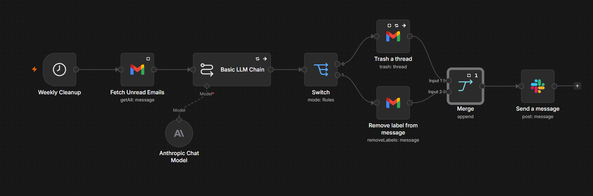
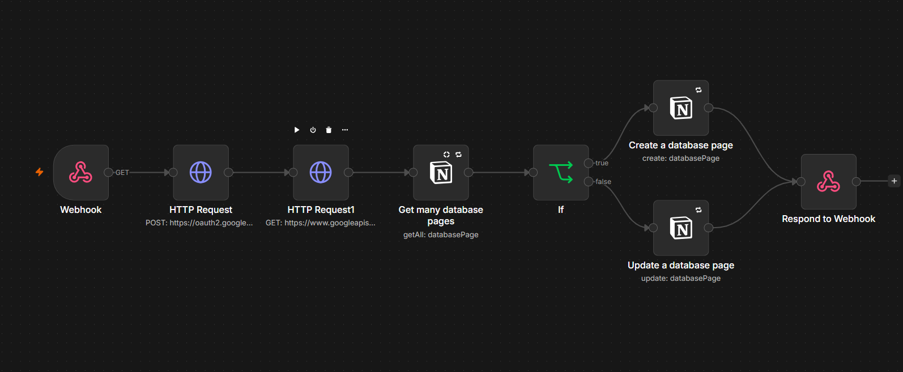
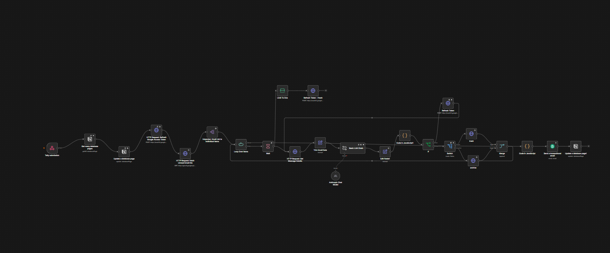

# Weekly Inbox Cleaner

A one-time, powerful inbox reset tool designed to clear massive email backlogs instantly.

## The Problem
I had nearly 300 emails cluttering my inbox, acting as a mental roadblock to testing and launching new projects. I didn't need "triage"—I needed a way to wipe the slate clean in one go.

## The Solution
I built this n8n workflow as a high-speed cleanup engine. It doesn't continuously organize your mail; it performs a deep, one-time pass to trash or archive the backlog, resetting your inbox to zero so you can start fresh.

## How It Works
* **Manual/Triggered Execution**: This is a "clean-and-reset" workflow that runs on-demand.
* **Batch Processing**: It fetches your unread emails and processes them in bulk.
* **Destructive Logic**: Designed specifically to trash irrelevant threads and archive the rest, clearing the clutter in a single execution.
* **Stop-State**: Once the cleanup is complete, the workflow remains idle until you decide you need another total reset.

## Benefits
* **Instant Inbox Zero**: Clears hundreds of emails without requiring you to click a single "delete" button.
* **Backlog Elimination**: Perfect for developers and founders who need to wipe stale data before starting a new sprint.
* **Controlled Reset**: You remain in total control of when the cleanup happens—no background interference.

---

# SmartInboxCleanup: Intelligent Inbox Cleanup

**SmartInboxCleanup** is an autonomous agent designed to process your existing email backlog. It executes a deep-clean of your inbox based on categorization rules you define via a Tally form (trash and archive).

## How It Works
* **Handshake:** The process begins with a secure link to grant the agent permission to your Gmail.
* **Redirection:** You are immediately redirected to a Tally form to define your cleanup criteria.
* **The Cleanup:** Submitting the form triggers an automated workflow that trashes or archives emails based on your specific commands.
* **AI Logic:** For emails that do not fall into your predefined categories, the AI analyzes their importance to make an autonomous decision.
* **Confirmation:** Once the cleanup is complete, a summary email is sent to you detailing exactly how many emails were handled.

## System Reliability
To ensure the workflow runs smoothly, I have included an automated error-handling trigger. If the workflow encounters an issue during execution, it instantly notifies me via Slack so I can address it immediately.
*Created by Juliet | Building founder-level automation systems.

For the "Weekly Inbox Cleaner" section:

For the "How It Works" section in SmartInboxCleanup:

For the "System Reliability" or final overview section:

This workflow intentionally takes time at two points: fetching message details, and AI categorization. Both delays are deliberate. Fetching message details is paced with a short delay between each request so Gmail's API doesn't rate limit or flag the account for too many rapid calls. AI categorization runs in small batches with a pause between each one, keeping the model's responses stable and reliable instead of firing everything at once. The tradeoff is a few extra minutes for a full inbox, in exchange for zero failed runs and no lost emails. 
**Real run example:** 75 emails processed end to end in 6 minutes 21 seconds, no errors, no rate limiting.

# SmartInboxCleanup: Handling a Real 18,000+ Email Inbox

## The Trigger

A real user connected an inbox with an estimated 18,352 emails, far beyond anything I'd tested before. This became an unplanned stress test that surfaced several real bugs invisible at normal scale.

## What Broke, In Order

1. **Out-of-memory crash.** Each email was carrying its full raw Gmail payload (headers, body structure, attachments metadata) through every node in the pipeline, even though only a handful of fields were actually used. At 18,352 emails, this exhausted available memory.

2. **A Node.js memory ceiling mismatch.** The server's memory allocation (`NODE_OPTIONS --max-old-space-size`) had been set for an earlier, smaller plan and never raised after upgrading the actual server resources. Node was quietly capping itself far below what was actually available, causing extreme slowness that looked like a stall, not a crash.

3. **A stale access token.** The workflow refreshed its Gmail access token once, at the very start of the run. On a run long enough to exceed the token's ~60 minute lifespan, later steps started failing quietly.

4. **A chunking design gap.** A loop was added to process emails in batches of 100 instead of all at once, but the loop wasn't wired to actually repeat, it would silently stop after the first batch.

5. **A stale reference inside the fix itself.** After building a fresh, per-batch token refresh, one downstream node was still pointing at the *original* token from the very start of the run, not the new per-batch one, causing the same expiration failure to resurface later in a run.

6. **A pairedItem crash.** The corrected token reference initially used a syntax (`.item`) that required n8n to trace a direct line back to a single-item side branch, which failed because that branch and the main branch process different numbers of items at once. Fixed by referencing `.last()` instead, which doesn't require that trace.

7. **A real Gmail rate limit hit.** Trash/archive batch speed was initially set to match the Gmail fetch step's proven-safe rate (12/sec). This turned out to be too aggressive specifically for the trash/modify endpoints, triggering a real "too many requests" error. Reduced to a more conservative batch size.

8. **n8n's own task runner timing out on very long executions.** After roughly 17 hours of continuous execution, the workflow failed at the Code in JavaScript1 node with: *"Task execution timed out after 300 seconds."* This is an n8n infrastructure-level timeout, unrelated to Gmail, Claude, or token expiration. It suggests n8n's own code-execution environment becomes sluggish the longer a single execution stays continuously alive. Before this failure, 73 complete batches (~7,300 emails) had been successfully processed. A second attempt later hit the identical error at the ~15 hour mark, after 70 batches (~7,000 emails), confirming this as a consistent, reproducible pattern rather than a one-off fluke.

## The Fixes

- Added a data-trimming step immediately after fetching each email's details, keeping only what's actually needed (id, threadId, subject, from, snippet) and discarding the rest.
- Corrected the server's memory allocation to match its actual upgraded capacity.
- Added chunked processing: emails are now handled in batches of 100 in a proper loop, rather than all at once.
- Added a token refresh that fires fresh at the start of every batch, not once for the whole run.
- Added a timeout so a single hung request fails fast and loud instead of hanging indefinitely.
- Tuned batch speeds for Gmail and Claude to match confirmed, safe rate limits.
- Identified and applied the fix for the task runner timeout: n8n's own documentation points to the `N8N_RUNNERS_TASK_TIMEOUT` environment variable, which raises the default 300-second ceiling. This required host-level access; the hosting provider added the variable, and it has since been set to 900 seconds, giving long-running tasks the breathing room they need.

## Real Numbers

- First ~4 hours: ~33 batches (~3,300 emails) processed. Pace: ~7.3 minutes per 100 emails (~73 min/1,000).
- Hours 4–14: pace slowed to roughly ~18 minutes per 100 emails during this stretch, alongside a rise in server memory usage (from a steady ~1.2–1.3GB up to 3–4.7GB), despite chunking. This suggests a single, very long-running execution may accumulate its own overhead over time, a separate cost from the per-batch memory problem chunking was built to solve.
- The run was interrupted twice by the task runner timeout described above (once after ~17 hours, once after a second attempt at ~15 hours), each time after several thousand real, permanent emails had already been processed. Since trashing and archiving happen live, batch by batch, this progress was never lost between attempts.
- A separate, smaller inbox run (107 emails) completed successfully end-to-end in **3 minutes 54 seconds**, run concurrently while the large inbox was still processing in a separate execution, confirming SmartInboxCleanup can handle multiple clients' cleanups running at the same time without interference.
- **The full 18,352-email inbox was successfully cleaned to completion**, across the sessions described above.

## Honest Takeaways

- For extreme-volume inboxes, total runtime is genuinely unpredictable. It depends on real-time API responsiveness (Gmail, Claude) outside my control, not just the email count. The clearest signal that a run is actually progressing, even when visible checks showed little change, was watching Claude API credit steadily decrease.
- Chunking solved the "too much data in memory at once" problem, but revealed a second, subtler one: very long single executions (many hours) seem to slow down and use more memory over time regardless of chunk size, eventually hitting n8n's own infrastructure limits rather than the workflow's logic.
- The contrast between a 3-minute-54-second run and a multi-attempt process spanning over 24 hours combined is itself the clearest evidence that runtime scales with more than just email count.
- A future improvement worth exploring: splitting extremely large inboxes across multiple separate execution runs by design (not just batches within one run), so no single execution has to stay alive for many hours at a time.
- This inbox size is a genuine outlier. Real numbers from this test inform honest customer-facing expectations, not the product's general performance claim, most inboxes will land much closer to the fast end.
