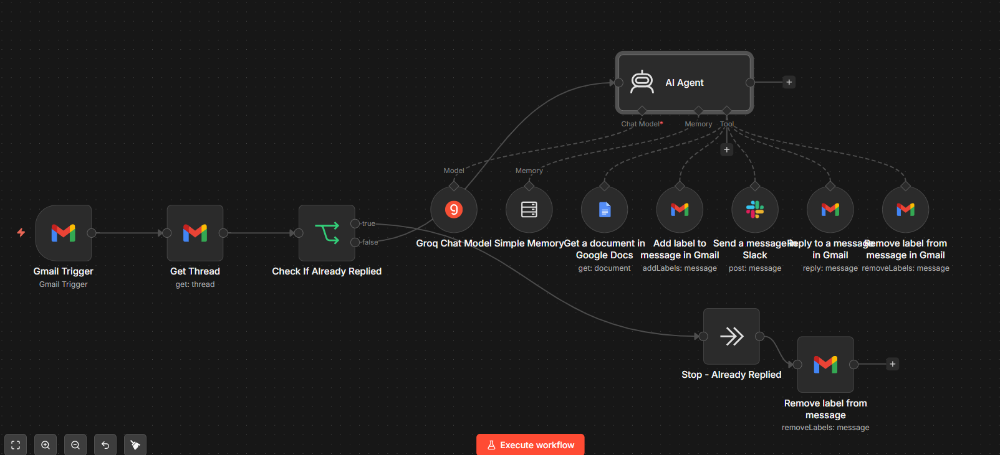
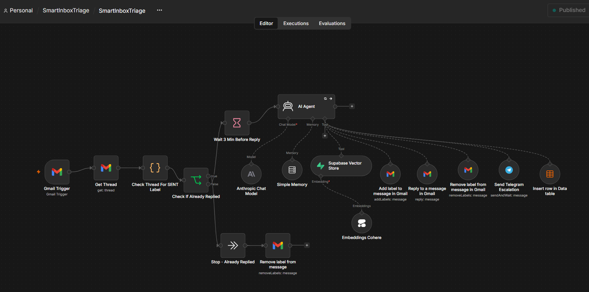
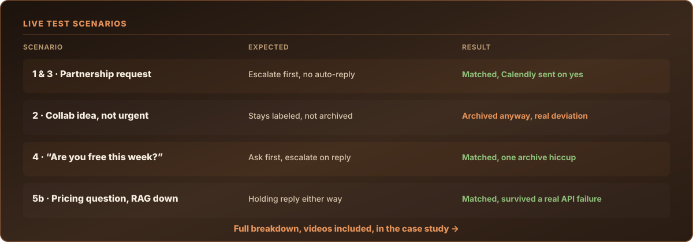

## SmartInboxTriage: Executive Inbox Agent

**SmartInboxTriage** is an always-on AI agent that watches a Gmail inbox, decides what each incoming email actually is, and acts on it, labeling, archiving, replying, or escalating, without a human touching the inbox first.

This was my first agent build, before SmartInboxCleanup. It's a different problem: SmartInboxCleanup is an on-demand, one-time deep clean of an existing backlog. SmartInboxTriage is a standing assistant that handles email as it arrives, every minute, forever.

## Version 1

- **Trigger:** Gmail Trigger (polls every minute)
- **Automation Engine:** n8n
- **Intelligence:** Groq (Llama 3.3 70B) via a LangChain Agent node
- **Memory:** Per-thread conversational memory, so the agent doesn't lose context across a back-and-forth
- **Tools available to the agent:** Gmail (label, archive, reply), Slack (notify), Google Calendar (create events), Google Docs (knowledge base lookup)

Filter first: before the AI ever sees an email, a rule check skips anything already handled, already replied, or an obvious unsubscribe-pattern email, so the agent isn't burning tokens re-deciding what's already settled. Decision matrix: the agent classifies every email into one of four lanes, urgent/high-value (label + Slack ping, no auto-reply, that stays a human decision), meeting/calendar updates (Slack ping only), general business (checked against a Google Doc knowledge base), or clutter (silently archived). Archive-last rule: removing the inbox label is always the final action, so nothing gets archived before it's actually been handled.

This version worked, but it was a single do-everything agent carrying one long, rigid prompt.

## Version 2

Version 2 splits the single agent into a small set of purpose-built n8n workflows instead of one long prompt trying to do everything:

- **Intelligence:** Claude, replacing Groq/Llama.
- **Knowledge base:** Cohere embeddings power real retrieval-augmented answers to general business questions, instead of a flat Google Doc lookup.
- **Escalation:** Telegram, replacing Slack, with an inline approval step. When something needs a human decision, I get the summary on Telegram and a single yes or no sends my Calendly link (or hands me the thread to reply to personally on a no).
- **Thread memory via labels:** an "awaiting response" label lets the agent recognize when someone replies to a conversation it already started, instead of treating every reply as a brand new email.
- **Daily Summary workflow:** a separate end-of-day digest so lower-priority items (labeled but not escalated in real time) still reach me, just without interrupting my day.
- **Trash check workflow:** a smarter alternative to unsubscribe links, which aren't always reliable. When the agent has silently archived 5 or more emails from the same sender within 14 days, the kind it already treats as clutter, it asks me whether I want that sender out of my inbox entirely. If I say yes, every future email from them gets marked and routed straight to trash on arrival, and it won't ask about the same sender twice.
- **Error workflow:** a dedicated monitoring workflow that flags infrastructure failures (like a dependency going down) on its own, separate from the agent's own reasoning.

## See it handle real email

I ran five live test scenarios against this system, real email, my own two test accounts talking to each other, including one where a real third-party API broke mid-run. Here's how it actually behaved:

[**Read the full case study, with videos and screenshots →**](case-study/README.md)
