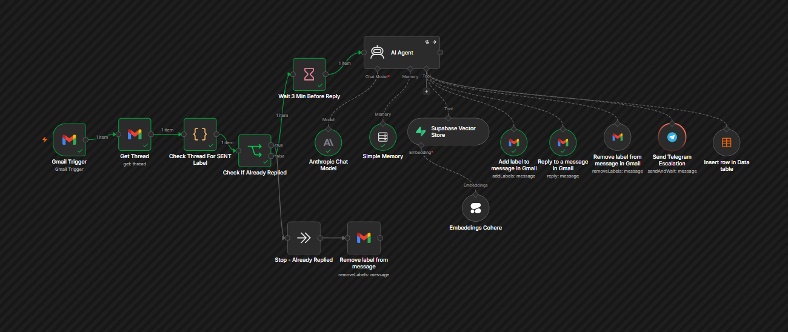
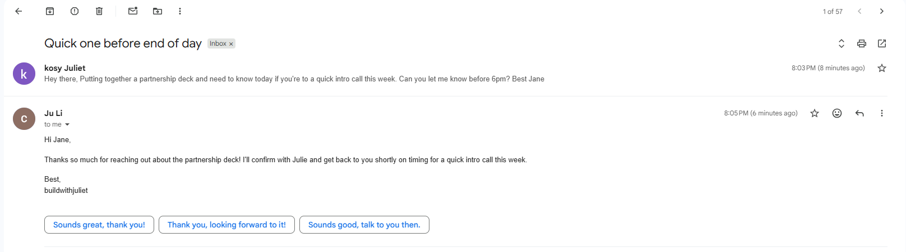
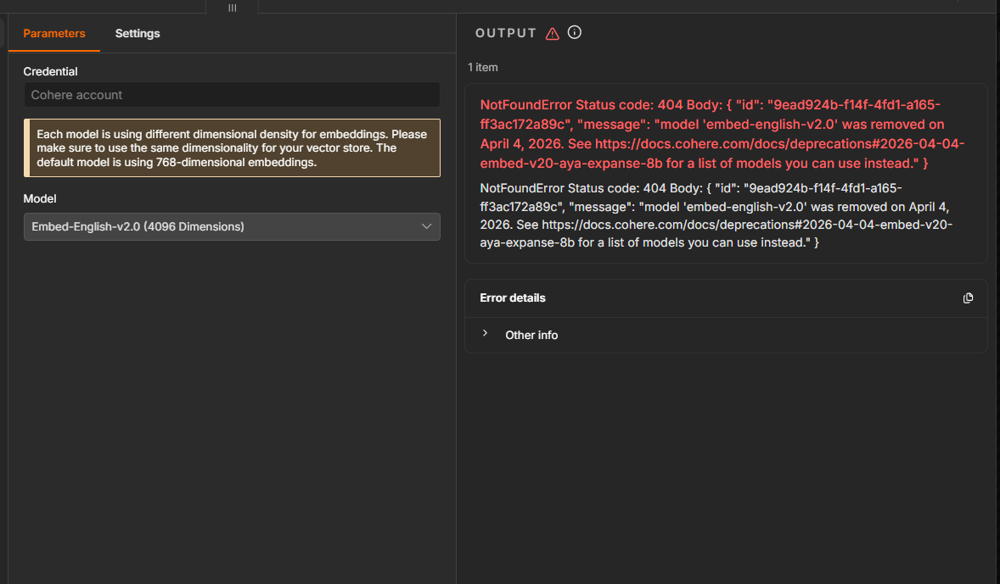

# Five Scenarios, One Inbox: Testing SmartInboxTriage v2 Live

I tested v2 against real email, sent from one of my own accounts to another, five scenarios covering the actual range of things a founder's inbox sees: a genuine partnership request, a vague message with no context, a non-urgent idea, and a pricing question that hit a real infrastructure failure mid-run. Here's what actually happened, videos and screenshots included, mistakes included too.

## The one that used the wrong prompt

Before any of the numbered scenarios, my very first live run used the previous prompt version by mistake, I hadn't confirmed the updated one was actually deployed. That's on me, not the system. Worth showing anyway, because it's an honest look at what happens when the wrong ruleset is live.

The email was a partnership inquiry. Under the current design, this type is supposed to escalate to me for a decision, not get an automatic reply. Under the old prompt, it replied directly instead, an acknowledgment, reasonable in tone, just not the intended behavior. It took a noticeably long time to send.

It still tried to escalate the case to Telegram afterward, but Telegram couldn't return a response to the workflow, so that run stalled on the approval step.




[Watch the full run](https://youtu.be/4joLbwLMPOA)

## Scenario 1 & 3: a time-sensitive partnership request

Both scenarios test the same behavior from different angles. A partnership request came in that was genuinely time-sensitive. Because it was urgent, the agent didn't act on its own, it escalated straight to me on Telegram and waited for a decision.

I clicked yes, and it sent my Calendly link to the person, it read as a warm response, not a robotic one. If I'd clicked no instead, that's my signal that I want to write a personal reply myself, the agent hands me the thread link in the same Telegram message either way.

[Watch the full run](https://youtu.be/keIgmvQo9gI)

## Scenario 2: a collaboration idea, not urgent

A collaboration idea came in with no time pressure attached. The agent labeled it and archived it, quietly, without pinging me on Telegram or interrupting anything. That label feeds an end-of-day summary that reaches me before I've even opened the inbox myself, so nothing gets lost, it just doesn't need to be a live interruption.

[Watch the full run](https://youtu.be/AiPLljCuElo)

## Scenario 4: a message with no context, in two parts

John's opening email was just "are you free this week?", nothing else. The agent replied asking him what he actually wanted to talk about, and labeled the thread "awaiting response" so it would recognize the conversation when he came back.

One thing didn't go cleanly here: archiving the original message failed with a Gmail API error (visible in the video). Not a crash, and not something that affected the reply or the labeling, just a message that stayed in the inbox a little longer than it should have. That's a known, occasional quirk, the kind of thing a human notices during a normal inbox check, or that gets swept up whenever [SmartInboxCleanup](https://smartinboxcleanup.buildwithjuliet.com/) runs a backlog clean.

John replied in the same video with his real reason: he wants to automate his processes and doesn't know where to start. His reply landed on the same thread, still carrying the "awaiting response" label, so the agent recognized it had unfinished business there. It summarized what John wanted and sent it to me on Telegram. I clicked yes, and my Calendly link went out to him.

[Watch the full run](https://youtu.be/GqpRyrW0o68)

## Scenario 5: a pricing question, and a real infrastructure failure

This is the one I'm proudest of, not because everything worked, but because of what happened when something didn't.

Someone asked a pricing question, something the agent's knowledge base is built to answer directly. But the embeddings model behind that knowledge base had been deprecated and pulled by Cohere without warning. The lookup failed outright:

```
NotFoundError, Status code: 404
"model 'embed-english-v2.0' was removed on April 4, 2026."
```

The agent didn't crash, and it didn't guess at a price. It treated the failure exactly the way it treats a genuine "I don't know," sent the person a professional holding reply acknowledging their question and promising to confirm the price range, labeled the thread, and escalated to me on Telegram. I chose to reply to that person myself, using the link the agent handed me.

I already knew the model had been deprecated before I even opened Telegram, a separate error workflow on this project flags failures like this on its own. The fallback logic wasn't built to catch a dead embeddings model specifically, it was built around "if the answer isn't confidently known, don't guess, ask." An API error turned out to be just another form of not knowing, and the system handled it the same way either way.



[Watch the full run](https://youtu.be/Q8ao5GZbZpY)

## Full findings

Every quirk mentioned above, plus a couple more found during testing that didn't make it into a numbered scenario, are written up in more technical detail in [testing-notes.md](../testing-notes.md) in the parent folder.

## Back to the overview

[← Back to SmartInboxTriage](../README.md)
